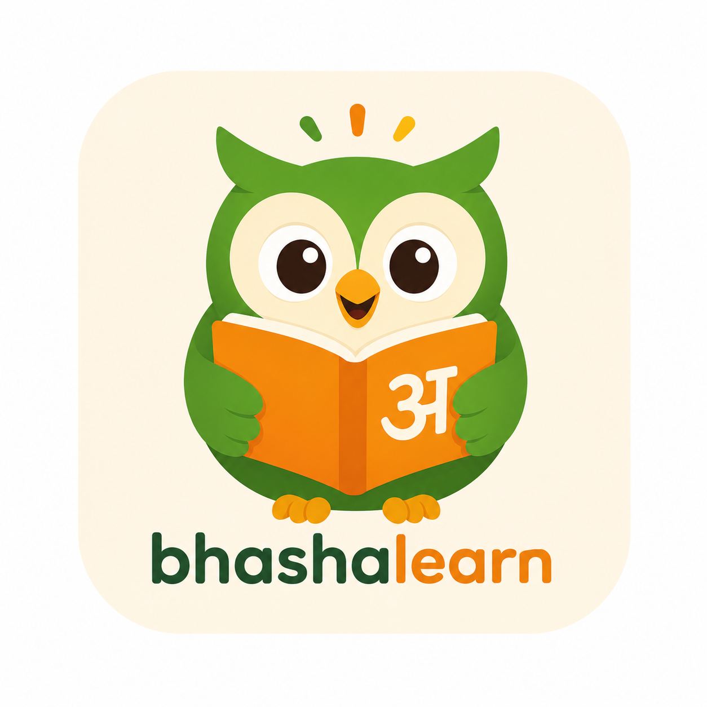

<div align="center">



# BhashaLearn 🦉

### *Learn Indian Languages the Fun Way*

**The Duolingo of India** — structured lessons, gamified quizzes, AI tutor, and streak tracking for 12 Indian languages.

[](https://bhashalearn.vercel.app)
[](https://reactjs.org)
[](https://deepmind.google/gemini)
[](https://supabase.com)

</div>

---

## 🌍 What is BhashaLearn?

India has **22 official languages** spoken by over a billion people — yet most Indians can only speak their mother tongue and Hindi. BhashaLearn bridges that gap.

It's a **web-based language learning platform** that lets you learn Indian languages through structured lessons, interactive quizzes, AI-powered tutoring, and daily practice — all wrapped in a beautiful, gamified experience that keeps you coming back.

> *"Bhasha" (भाषा) means "language" in Sanskrit — the root of every Indian language.*

---

## 🗣️ Supported Languages

| Language | Script | Speakers |
|----------|--------|----------|
| 🟠 Bhojpuri | भोजपुरी | ~50 million |
| 🔴 Tamil | தமிழ் | ~75 million |
| 🟡 Telugu | తెలుగు | ~85 million |
| 🟣 Marathi | मराठी | ~83 million |
| 🟢 Bengali | বাংলা | ~230 million |
| 🔵 Gujarati | ગુજરાતી | ~55 million |
| 🟤 Kannada | ಕನ್ನಡ | ~44 million |
| ⚪ Malayalam | മലയാളം | ~38 million |
| 🟡 Punjabi | ਪੰਜਾਬੀ | ~125 million |
| 🔵 Odia | ଓଡ଼ିଆ | ~35 million |
| 🟢 Urdu | اردو | ~70 million |
| 🔴 Assamese | অসমীয়া | ~15 million |

---

## ✨ Features

### 📚 Structured Learning Path
A **Duolingo-style skill tree** with 8 Units and 32 lessons per language — each one unlocks only after you complete the previous. Progress is saved per language so your Tamil journey doesn't affect your Bengali one.

```
Unit 1 🌱 Getting Started    →  Greetings, Numbers, Food, Family
Unit 2 ☀️ Daily Life         →  Introduce Yourself, At a Café, Age, Colors
Unit 3 🗺️ Getting Around     →  Directions, Transport, Shopping, Time
Unit 4 💬 Express Yourself   →  Feelings, Weather, Body Parts, Challenge
Unit 5 🏠 Home & Places      →  Rooms, Furniture, City, Nature & Animals
Unit 6 💼 Work & School      →  Professions, School, Money, Daily Routine
Unit 7 🎭 Stories & Culture  →  Festivals, Clothes, Health, Proverbs
Unit 8 👑 Master Level       →  Advanced Talk, News, Literature, Grand Final 🎓
```

### ⚡ 3 Quiz Modes
- **🎯 Multiple Choice** — AI-generated questions via Gemini 2.5 Flash
- **🔤 Word Jumble** — tap letter tiles to spell out the word
- **💬 Sentence Builder** — arrange word tiles in the correct order

### 🔥 Streak & Gamification
- **Daily streak tracker** with calendar — only increments after real activity (lesson or quiz)
- **Streak reminder banner** — warns you when your streak is at risk, urgency increases after 8 PM
- **Duolingo-style streak popup** — celebrates milestone streaks (3, 7, 14, 30 days)
- **XP system** — earn XP from lessons and quizzes, level up every 20 XP
- **12 badges** — First Step, Quiz Master, Polyglot, Week Warrior, Legend and more
- **Leaderboard** — compete with other learners

### 🤖 AI-Powered Features
- **Gemini AI Tutor** — chat with an AI that teaches in your chosen language, gives examples, quizzes you, and explains grammar
- **AI Quiz Generator** — every MCQ quiz is freshly generated by Gemini for your chosen language
- **AI Lesson Generator** — type any topic and get a custom vocabulary lesson

### 🔊 Text-to-Speech
Hear every word pronounced correctly using Google TTS — supports all 12 Indian languages. Falls back to roman transliteration if the voice pack isn't available on your device.

### 🌙 Dark Mode
Full dark mode support with a warm saffron-and-cream palette. Toggle anytime from the sidebar.

### 📊 Analytics & Progress
- Lesson completion tracking per language
- Quiz score history with date and percentage
- XP, level, streak, words learned — all on one dashboard
- Star rating (⭐⭐⭐) for each lesson based on quiz score

---

## 🛠️ Tech Stack

| Layer | Technology |
|-------|-----------|
| Frontend | React 18, React Router v6 |
| Styling | Custom CSS + CSS Variables (no UI library) |
| Auth & DB | Supabase (PostgreSQL + Auth) |
| AI | Google Gemini 2.5 Flash API |
| TTS | Google Translate TTS + Web Speech API |
| Sound FX | Web Audio API (zero dependencies) |
| Deployment | Vercel |

---

## 🚀 Getting Started

### Prerequisites
- Node.js 18+
- A Supabase account
- A Google Gemini API key

### Installation

```bash
# Clone the repository
git clone https://github.com/yashieeeeee/bhashalearn.git
cd bhashalearn

# Install dependencies
npm install

# Create environment file
cp .env.example .env
```

### Environment Variables

Create a `.env` file in the root:

```env
REACT_APP_GEMINI_API_KEY=your_gemini_api_key_here
```

Your Supabase URL and anon key are in `src/utils/supabase.js`.

### Supabase Setup

Create a `profiles` table in your Supabase project:

```sql
create table profiles (
  id uuid references auth.users primary key,
  streak int default 0,
  last_active date,
  total_xp int default 0,
  words_learned int default 0,
  lessons_completed int default 0,
  perfect_quizzes int default 0,
  badges text[] default '{}',
  bookmarks jsonb default '[]',
  lesson_progress jsonb default '{}',
  xp_map jsonb default '{}',
  display_name text
);

create table quiz_scores (
  id uuid default gen_random_uuid() primary key,
  user_id uuid references auth.users,
  score int,
  total int,
  topic text,
  created_at timestamptz default now()
);

create table progress (
  user_id uuid references auth.users,
  lesson_id text,
  lesson_progress int,
  completed boolean default false,
  updated_at timestamptz,
  primary key (user_id, lesson_id)
);
```

### Run Locally

```bash
npm start
```

Open [http://localhost:3000](http://localhost:3000) in your browser.

---

## 📁 Project Structure

```
src/
├── components/
│   ├── Sidebar.jsx          # Navigation sidebar + mobile drawer
│   ├── AiTutor.jsx          # Floating AI tutor chat widget
│   └── StreakPopup.jsx      # Duolingo-style streak celebration popup
├── context/
│   ├── AuthContext.jsx      # Supabase auth + profile state
│   └── ThemeContext.jsx     # Dark/light mode toggle
├── data/
│   ├── content.js           # All vocabulary data for 12 languages
│   └── curriculum.js        # 8 units × 4 lessons structured path
├── pages/
│   ├── Home.jsx             # Dashboard with streak, XP, quick actions
│   ├── Lessons.jsx          # Duolingo-style path map + lesson quiz
│   ├── Quiz.jsx             # MCQ, Word Jumble, Sentence Builder
│   ├── Daily.jsx            # Daily challenge with word of the day
│   ├── Flashcards.jsx       # Spaced repetition flashcard review
│   ├── Pronunciation.jsx    # TTS-powered pronunciation practice
│   ├── LearningPath.jsx     # Visual learning roadmap
│   ├── Achievements.jsx     # Badges + leaderboard
│   ├── Analytics.jsx        # Progress charts and stats
│   ├── Bookmarks.jsx        # Saved words for review
│   └── Auth.jsx             # Login / signup
└── utils/
    ├── supabase.js          # Supabase client + all DB helpers
    ├── claude.js            # Gemini AI API calls
    └── sounds.js            # Web Audio API sound effects
```

---

## 🎮 How Learning Works

1. **Pick a language** — choose from 12 Indian languages
2. **Follow the path** — start with Unit 1, Lesson 1 (Greetings)
3. **Study vocabulary** — flip cards, hear pronunciations
4. **Take the quiz** — 5 questions, 3 lives, instant feedback
5. **Earn stars** — 100% = ⭐⭐⭐, unlock the next lesson
6. **Build your streak** — come back daily to keep it alive
7. **Level up** — earn XP, unlock badges, climb the leaderboard

---

## 🤝 Contributing

Contributions are welcome! Here's what would help most:

- **More vocabulary** — add words/lessons to `src/data/content.js`
- **New languages** — follow the existing pattern in `LESSONS_DATA`
- **Bug fixes** — open an issue first, then a PR
- **Translations** — UI currently in Hinglish + English

```bash
# Fork the repo, create a branch
git checkout -b feature/add-sindhi-language

# Make your changes, then
git commit -m "feat: add Sindhi language support"
git push origin feature/add-sindhi-language
# Open a Pull Request
```

---

## 📸 Screenshots

| Home Dashboard | Lesson Path | Quiz |
|---|---|---|
| Streak tracker, XP, quick actions | 8 units, locked/unlocked nodes | MCQ, Jumble, Sentence Builder |

---

## 📄 License

MIT License — free to use, modify and distribute.

---

<div align="center">

Made with ❤️ for India's linguistic diversity

**If BhashaLearn helped you, give it a ⭐ on GitHub!**

[🌐 Live Demo](https://bhashalearn.vercel.app) · [🐛 Report Bug](https://github.com/yashieeeeee/bhashalearn/issues) · [✨ Request Feature](https://github.com/yashieeeeee/bhashalearn/issues)

</div>
